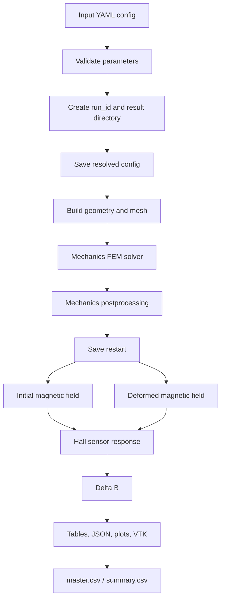

# Magnetic Cilium Pipeline

Программный комплекс для расчёта деформации двухслойной магнитной реснички и изменения магнитного поля на датчике Холла.

Проект решает две связанные задачи:

- механика: FEM-расчёт деформации реснички и подложки;
- магнитостатика: расчёт поля в начальном и деформированном положении, вычисление отклика датчика Холла.

Код организован как Python-пакет `magnetic_cilium` с CLI-интерфейсом `cilium`.

## 1. Где находится проект

Основная директория проекта:

```bash
cd /home/pie/programming/magnetic_clilium/magnetic_cilium_pipeline
```

Результаты расчётов по умолчанию сохраняются вне исходного кода:

```text
/home/pie/programming/magnetic_clilium/results/
```

Это важно для воспроизводимости: исходники, конфигурации и результаты не смешиваются.

## 2. Установка окружения

Для лёгких проверок конфигов достаточно Python и `pyyaml`:

```bash
python -m pip install -e .
```

Для реальных FEM-расчётов нужен FEniCSx/DOLFINx, gmsh и MPI. Рекомендуемое окружение описано в `environment.yaml`:

```bash
conda env create -f environment.yaml
conda activate fenicsx010
python -m pip install -e .
```

Проверить, что CLI доступен:

```bash
cilium --help
```

Если пакет не установлен в editable-режиме, все команды можно запускать так:

```bash
python -m magnetic_cilium.cli.main --help
```

Дальше в README будут показаны оба варианта, но основной рекомендуемый вариант после установки:

```bash
cilium ...
```

## 3. Быстрые проверки без тяжёлого расчёта

Проверка YAML-конфига:

```bash
cilium validate magnetic_cilium/config/presets/final_mechanics.yaml
```

То же самое через модуль:

```bash
python -m magnetic_cilium.cli.main validate magnetic_cilium/config/presets/final_mechanics.yaml
```

JSON-отчёт валидации:

```bash
cilium validate magnetic_cilium/config/presets/final_mechanics.yaml --json
```

Dry-run полного плана без запуска solver-ов:

```bash
cilium mechanics magnetic_cilium/config/presets/final_mechanics.yaml --engine new --dry-run
```

Dry-run показывает:

- распознанный режим расчёта;
- resolved config;
- будущий `run_id`;
- директорию результата;
- последовательность шагов pipeline;
- какие backend-и будут использованы.

## 4. Основные CLI-команды

Общая форма команды:

```bash
cilium <command> <config.yaml> [--engine runtime|new] [--dry-run] [-- <extra runtime args>]
```

Доступные основные команды:

```text
validate      проверить YAML-конфиг без расчёта
dry-run       показать resolved config и run context
mechanics     запустить расчёт механики
full          запустить механику и магнитный постпроцессинг
magnetics     посчитать магнитный отклик по готовому restart
magnetic-only алиас для магнитного расчёта по restart
sweep         запустить параметрический магнитный sweep
interpolate   построить интерполяцию по master.csv
validation    запустить validation-режим механики
```

Параметр `--engine`:

- `runtime` - основной рабочий backend, сохраняет текущее поведение solver-ов;
- `new` - новый архитектурный orchestration-layer; удобен для `dry-run` и постепенно используется как основной слой;
- `legacy` - совместимый алиас к `runtime`.

Для реальных FEM-расчётов сейчас используйте:

```bash
--engine runtime
```

Для проверки архитектурного плана без вычислений:

```bash
--engine new --dry-run
```

## 5. Конфигурационные файлы

Основные готовые пресеты лежат здесь:

```text
magnetic_cilium/config/presets/
```

Текущие пресеты:

```text
debug_small.yaml      маленький механический пример для отладки
final_mechanics.yaml  основной расчёт механики
sensor_sweep.yaml     пример sweep по положению датчика
validation.yaml       validation-конфигурация механики
```

Дополнительные экспериментальные конфиги лежат здесь:

```text
configs/
```

В проекте поддерживаются плоские YAML-конфиги. Пример минимального конфига для новой реснички:

```yaml
mode: mechanics
outdir: ../results/new_cilium_mechanics
results_write_mode: experiment
experiment_id: new_cilium_001

D: 120.0e-6
L1: 2.0e-3
L2: 2.0e-3
substrate_radius: 0.60e-3
substrate_thickness: 0.50e-3

h_cilium: 20.0e-6
h_substrate: 100.0e-6
element_degree: 2
n_steps: 10
delta: 0.55e-3
save_mechanics_frames: true
mechanics_frames_every: 2

Br: 0.10
sensor_x: 0.0
sensor_y: 0.0
sensor_z: -50.0e-6
rotate_magnetization: true
```

Сохраните такой файл, например:

```text
magnetic_cilium/config/presets/new_cilium_mechanics.yaml
```

## 6. Что означают основные параметры

Геометрия:

```text
D                    диаметр реснички, м
L1                   длина нижнего немагнитного сегмента, м
L2                   длина верхнего магнитного сегмента, м
substrate_radius     радиус основания, м
substrate_thickness  толщина основания, м
```

Сетка:

```text
h_cilium        характерный размер элемента в ресничке
h_substrate     характерный размер элемента в основании
h_air           характерный размер элемента воздушной области для FEM-магнитостатики
element_degree  степень FEM-элементов
```

Механика:

```text
delta      заданное смещение верхней части реснички по x, м
n_steps    число шагов нагружения
nu         коэффициент Пуассона, если используется общий параметр
save_mechanics_frames  сохранять PNG-кадры деформации по шагам нагружения
mechanics_frames_every сохранять каждый N-й кадр; 1 означает каждый шаг
```

Магнитика:

```text
Br                         эффективная остаточная индукция магнитного сегмента, Тл
sensor_x, sensor_y, sensor_z положение датчика Холла, м
sensor_average             усреднять поле по чувствительной области датчика
sensor_average_radius      радиус области усреднения
sensor_average_n           число точек усреднения по направлению
rotate_magnetization       поворачивать намагниченность вместе с деформацией
magnetic_boundary          natural или dirichlet_zero
```

Вывод:

```text
outdir              директория результата
restart_dir         директория готового механического restart для magnetic-only
master_csv_path     общий CSV со строками магнитных расчётов
results_write_mode  debug или experiment
experiment_id       человекочитаемый идентификатор серии
```

Для механических расчетов дополнительно пишется `mechanics_newton_steps.csv`.
В нем по каждому шагу нагружения сохранены заданное смещение, реакция по x,
число итераций Ньютона и пути к PNG-кадрам, если включены `save_mechanics_frames`.
Даже если `mechanics_frames_every` больше 1, CSV все равно содержит все шаги.

## 7. Пример: расчёт механики новой реснички

1. Создайте YAML-конфиг, например `magnetic_cilium/config/presets/new_cilium_mechanics.yaml`.

2. Проверьте конфиг:

```bash
cilium validate magnetic_cilium/config/presets/new_cilium_mechanics.yaml
```

3. Посмотрите план без расчёта:

```bash
cilium mechanics magnetic_cilium/config/presets/new_cilium_mechanics.yaml --engine new --dry-run
```

4. Запустите реальный расчёт механики:

```bash
cilium mechanics magnetic_cilium/config/presets/new_cilium_mechanics.yaml --engine runtime
```

После расчёта результаты будут лежать в директории из `outdir`, например:

```text
../results/new_cilium_mechanics/
```

Там ожидаются summary-файлы, логи, VTK/PVD-артефакты и restart-состояние, если расчёт дошёл до сохранения механики.

## 8. Пример: полный расчёт mechanics + magnetics

Полный режим сначала считает механику, затем магнитный отклик.

Проверка:

```bash
cilium full magnetic_cilium/config/presets/final_mechanics.yaml --engine new --dry-run
```

Реальный запуск:

```bash
cilium full magnetic_cilium/config/presets/final_mechanics.yaml --engine runtime
```

Используйте полный режим, если нужно получить сразу:

- деформированное состояние;
- реакцию;
- `J = det(F)`;
- von Mises;
- магнитное поле до и после деформации;
- `Delta B`;
- summary-таблицы.

## 9. Пример: магнитный расчёт по готовому restart

Этот режим нужен, когда механика уже посчитана, а вы хотите менять положение датчика, `Br`, усреднение или параметры магнитного постпроцессинга без повторного механического FEM-расчёта.

Пример конфига должен содержать `restart_dir`:

```yaml
mode: magnetics
restart_dir: ../results/magnetic_cilium_3d_results_final/final_P2_hcil_20um_hsub_100um_delta_0p550mm
outdir: ../results/magnetic_cilium_3d_results_final
master_csv_path: ../results/magnetic_results_master.csv

Br: 0.10
sensor_x: 0.0
sensor_y: 0.0
sensor_z: -50.0e-6
rotate_magnetization: true
```

Проверка:

```bash
cilium validate configs/magnetic_under_cilium_dipole_comparison.yaml
```

Запуск:

```bash
cilium magnetics configs/magnetic_under_cilium_dipole_comparison.yaml --engine runtime
```

Переопределить отдельные параметры из командной строки можно после разделителя `--`:

```bash
cilium magnetics configs/magnetic_under_cilium_dipole_comparison.yaml -- --sensor-z=-100e-6 --Br 0.12
```

## 10. Пример: FEM-магнитостатика и sweep

Sweep-конфиги имеют вложенную структуру:

```yaml
global:
  mode: magnetics-fem-validation
  restart_dir: ../results/...
  output_dir: ../results/magnetic_fem_sensor_position_results
  master_csv_path: ../results/magnetic_results_master.csv

fixed_physical_parameters:
  Br: 0.10
  sensor_y: 0.0

sweep:
  sensor_position:
    cases:
      - id: center_z_50um
        sensor_x_over_r: 0.0
        sensor_z: -50.0e-6
```

Проверка:

```bash
cilium validate magnetic_cilium/config/presets/sensor_sweep.yaml
```

План без расчёта:

```bash
cilium sweep magnetic_cilium/config/presets/sensor_sweep.yaml --dry-run
```

Реальный запуск:

```bash
cilium sweep magnetic_cilium/config/presets/sensor_sweep.yaml -- --master-csv-path ../results/magnetic_results_master.csv
```

Важно: FEM-sweep может быть тяжёлым. Перед запуском проверьте `h_air`, `h_air_near`, `h_air_far`, `max_air_cells` и число cases.

## 11. Пример: интерполяция по результатам sweep

Интерполяция читает `master.csv` и создаёт таблицы/точки для следующих расчётов.

```bash
cilium interpolate configs/interpolate_sensor_position.yaml \
  -- --input-csv ../results/magnetic_results_master.csv \
  --output-dir ../results/interpolation/sensor_position
```

Ожидаемые файлы:

```text
../results/interpolation/sensor_position/interpolation_report.json
../results/interpolation/sensor_position/interpolation_grid.csv
../results/interpolation/sensor_position/next_points.csv
```

## 12. Готовые shell-сценарии

В директории `scripts/` лежат сценарии для длинных экспериментальных серий.

Запуск магнитного sweep + interpolation:

```bash
bash scripts/run_magnetic_experiment_pipeline.sh
```

Запуск under-cilium серии:

```bash
bash scripts/run_under_cilium_magnetic_pipeline.sh
```

Управлять стадиями можно переменными окружения:

```bash
RUN_SENSOR_AREA=1 \
RUN_BR_AREA=0 \
RUN_DISTANCE_SWEEP=0 \
RUN_COMPARISON=1 \
bash scripts/run_under_cilium_magnetic_pipeline.sh
```

Такие сценарии могут работать долго. Для быстрой проверки сначала используйте `cilium validate` и `--dry-run` для соответствующих YAML.

## 13. Где искать результаты

Основные результаты находятся в:

```text
../results/
```

Типичные файлы:

```text
summary.csv                  краткая таблица механики/full-запуска
mechanics_summary.csv        краткая таблица mechanics-only
magnetic_summary.csv         магнитный summary для restart-расчёта
magnetic_results_master.csv  общий master CSV по магнитным расчётам
result.json                  machine-readable результат нового pipeline
resolved_config.yaml/json    сохранённая конфигурация запуска, если режим её пишет
*.pvd, *.vtu, *.xdmf         поля и геометрия для визуализации
*.npz                        restart/численное состояние
*.log                        лог запуска
```

Для диплома полезно сохранять:

- исходный YAML;
- `run_id`;
- `summary.csv` или `magnetic_summary.csv`;
- строку в `magnetic_results_master.csv`;
- restart-директорию;
- все графики и VTK/PVD-файлы, использованные в отчёте.

## 14. Как устроен pipeline

Общая логика расчёта:



Архитектурные блоки:

```text
magnetic_cilium/config/        схемы и загрузка YAML
magnetic_cilium/geometry/      геометрия, теги, gmsh mesh
magnetic_cilium/mechanics/     механическая постановка, solver, postprocess
magnetic_cilium/magnetics/     дипольная и FEM-магнитостатика, датчик
magnetic_cilium/postprocess/   quality, таблицы, интерполяция
magnetic_cilium/io/            run context, JSON, restart, master table
magnetic_cilium/visualization/ спецификации визуализаций
magnetic_cilium/pipeline/      сценарии расчётов
magnetic_cilium/cli/           CLI
magnetic_cilium/tests/         unit/smoke/regression проверки
```

## 15. Проверка проекта разработчиком

Лёгкая проверка синтаксиса:

```bash
python -m compileall -q magnetic_cilium
```

Unit/smoke/regression тесты без тяжёлого FEM:

```bash
python -m unittest discover -s magnetic_cilium/tests
```

Проверка всех пресетов:

```bash
cilium validate magnetic_cilium/config/presets/debug_small.yaml
cilium validate magnetic_cilium/config/presets/final_mechanics.yaml
cilium validate magnetic_cilium/config/presets/sensor_sweep.yaml
cilium validate magnetic_cilium/config/presets/validation.yaml
```

## 16. Практический рабочий порядок

Для нового расчёта обычно удобно идти так:

1. Скопировать ближайший YAML-пресет.
2. Изменить геометрию, сетку, нагрузку и положение датчика.
3. Запустить `cilium validate`.
4. Запустить `--engine new --dry-run`.
5. Убедиться, что `outdir` указывает в `../results/...`.
6. Запустить реальный расчёт через `--engine runtime`.
7. Проверить summary, log и restart.
8. При необходимости запускать магнитные варианты по готовому restart.
9. Собирать серии в `master_csv_path`.
10. Использовать interpolation/sweep для выбора следующих точек.

## 17. Важные замечания

- Единицы измерения в конфигурациях - СИ: метры, паскали, тесла.
- Отрицательный `sensor_z` означает датчик ниже основания, если используется текущая система координат.
- Реальные FEM-расчёты запускайте только в окружении с DOLFINx.
- Не храните большие результаты внутри `magnetic_cilium_pipeline/`; используйте `../results/`.
- Перед длинным sweep обязательно проверяйте число cases и параметры сетки.
- Для воспроизводимости не меняйте YAML после расчёта без сохранения копии или нового `experiment_id`.
